# Basketball Video Analyzer - Architecture

This document describes the current system architecture. For implementation details and roadmap, see [implementation-plan.md](./implementation-plan.md).

## System Overview

Basketball Video Analyzer is a local-first application for analyzing youth basketball game videos. It combines a React frontend with a Python FastAPI backend, using computer vision for semi-automatic player detection and tracking.



*[View Mermaid source](./diagrams/system-architecture.mmd)*

### Key Architectural Decisions

| Decision | Choice | Rationale |
|----------|--------|-----------|
| **Local-first** | SQLite + Local filesystem | Privacy, no cloud dependency, works offline |
| **Backend language** | Python | ML/CV ecosystem (PyTorch, OpenCV, ultralytics) |
| **Frontend framework** | React + TypeScript | Component reuse, type safety, ecosystem |
| **ML inference** | CPU/MPS/CUDA auto-detect | Run on consumer hardware without GPU requirement |
| **Tracking** | Multiple backends (ByteTrack, Norfair) | Flexibility for different use cases |

## Backend Architecture

The backend follows a layered architecture with clear separation of concerns.



*[View Mermaid source](./diagrams/backend-services.mmd)*

### Layer Responsibilities

#### API Layer (`app/api/`)

REST endpoints using FastAPI with automatic OpenAPI documentation.

| Module | Purpose |
|--------|---------|
| `games.py` | Game CRUD operations |
| `videos.py` | Video metadata and listing |
| `video_upload.py` | Video file upload with multipart handling |
| `players.py` | Player CRUD operations |
| `game_rosters.py` | Game-player associations |
| `annotations.py` | Annotation CRUD with multi-video support |
| `detection.py` | Detection job management |
| `timeline.py` | Unified game timeline data |

#### Services Layer (`app/services/`)

Business logic and orchestration.

| Module | Purpose |
|--------|---------|
| `video_storage.py` | File management, path resolution |
| `thumbnail_generator.py` | FFmpeg-based thumbnail extraction |
| `timeline_sequencer.py` | Video ordering and game time calculation |
| `job_manager.py` | Background job queue and worker management |
| `detection_pipeline.py` | Detection job worker registration |
| `batch_orchestrator.py` | Batch-based processing coordination |
| `batch_processor.py` | Individual batch detection and OCR |
| `frame_extractor.py` | OpenCV frame extraction with sampling |
| `track_merger.py` | Post-processing track consolidation |
| `jersey_aggregator.py` | OCR result aggregation per track |

#### ML Layer (`app/ml/`)

Computer vision and machine learning components.

| Module | Purpose |
|--------|---------|
| `base.py` | `BaseDetector` abstract interface |
| `yolo_detector.py` | YOLOv8 object detection |
| `rfdetr_detector.py` | RF-DETR object detection (default) |
| `byte_tracker.py` | ByteTrack multi-object tracking |
| `norfair_tracker.py` | Norfair tracking |
| `sam2_tracker.py` | SAM2 embedding-based tracking (default) |
| `jersey_ocr.py` | SmolVLM2 vision-language model for jersey numbers |
| `court_detector.py` | Color-based court segmentation |
| `color_extractor.py` | Jersey color histogram extraction |
| `legibility_filter.py` | OCR candidate filtering |

## ML Pipeline

The detection pipeline processes video frames through multiple stages.



*[View Mermaid source](./diagrams/ml-pipeline.mmd)*

### Pipeline Stages

1. **Frame Extraction**: Sample frames at configurable interval (default: every 3rd frame)
2. **Object Detection**: Detect people using YOLO or RF-DETR
3. **Court Filtering**: Remove detections outside basketball court bounds
4. **Player Tracking**: Assign consistent IDs across frames using ByteTrack or Norfair
5. **Color Extraction**: Extract jersey color histograms for each detection
6. **Jersey OCR**: Read jersey numbers using SmolVLM2 vision-language model
7. **Post-Processing**: Merge fragmented tracks, aggregate OCR results

### Configurable Backends

```python
# Detection backends (config.detection_backend)
"yolo"   # YOLOv8 - faster, good for real-time
"rfdetr" # RF-DETR - better accuracy (default)

# Tracking backends (config.tracking_backend)
"bytetrack" # ByteTrack - robust to occlusion
"norfair"   # Norfair - simpler, good defaults
"sam2"      # SAM2 - embedding-based re-identification (default)

# Device selection (config.ml_device)
"auto"  # Auto-detect best available (default)
"cpu"   # Force CPU
"mps"   # Apple Silicon GPU
"cuda"  # NVIDIA GPU
```

### SAM2 Tracking Architecture

The SAM2 tracker uses a two-tier embedding architecture for robust player re-identification:


*[View Mermaid source](./diagrams/sam2-tracking.mmd)*

#### Tier 1: In-Memory Track State

During video processing, each track maintains:
- **Embedding vector**: Extracted from SAM2's image encoder (~256-512 dims)
- **Color histogram**: Jersey/shoe colors for tiebreaking
- **Last mask/bbox**: For spatial consistency checks

Matching uses embedding cosine similarity as primary signal, with color as tiebreaker when scores are close.

#### Tier 2: Database Persistence

At video end, best embeddings are stored in `player_embeddings` table:
- Enables cross-video re-identification within a game
- Links to player records for cross-game identity
- Loaded at video start for immediate matching

#### Future: Video Predictor Mode

SAM2's Video Predictor offers built-in memory and mask propagation but requires frames saved to disk as JPEGs. Could be added as post-processing refinement step for offline batch processing.

## Batch Processing Pipeline

Long-running video processing uses a batch-based architecture for resilience.



*[View Mermaid source](./diagrams/batch-processing.mmd)*

### Key Features

- **Checkpointing**: Each batch writes to database immediately
- **Resume**: Interrupted jobs resume from last incomplete batch
- **Extend**: Adding time range extends (doesn't restart) existing batches
- **Parallel OCR**: ThreadPoolExecutor processes multiple crops concurrently

### Configuration

| Setting | Default | Description |
|---------|---------|-------------|
| `BATCH_FRAMES_PER_BATCH` | 30 | Frames per processing batch |
| `BATCH_SAMPLE_INTERVAL` | 3 | Sample every Nth frame |
| `OCR_MAX_WORKERS` | 4 | Parallel OCR threads |
| `BATCH_EXECUTION_MODE` | sequential | Execution strategy |

## Data Model

The database schema supports multi-video games with unified timeline annotations.



*[View Mermaid source](./diagrams/data-model.mmd)*

### Key Relationships

- **Games → Videos**: One game contains multiple video files
- **Games ↔ Players**: Many-to-many via `game_rosters` (with jersey override)
- **Annotations → Videos**: Many-to-many via `annotation_videos` (multi-angle support)
- **Annotations → Plays**: One-to-one for play-type annotations
- **Videos → Detections**: Frame-level player bounding boxes with tracking IDs
- **Videos → Processing Batches**: Batch status for resume capability

### Notable Tables

| Table | Purpose |
|-------|---------|
| `processing_batches` | Track batch completion for resume |
| `jersey_numbers` | Raw OCR results per frame/track |
| `player_detections` | Frame-level bounding boxes |

## Frontend Architecture

The React frontend uses Mantine UI with Zustand for state management.



*[View Mermaid source](./diagrams/frontend-architecture.mmd)*

### Key Components

| Component | Purpose |
|-----------|---------|
| `GameTimelinePlayer` | Unified multi-video playback with timeline |
| `MultiVideoPlayer` | Handles video switching and synchronization |
| `TimelineBar` | Visual timeline with video segment indicators |
| `AnnotationPanel` | Side panel for annotation management |
| `DetectionOverlay` | Render bounding boxes on video |

### State Management

- **Zustand stores**: `timelineStore` for playback state, global store for app state
- **Local state**: Component-specific state for forms and UI

## Technology Stack Summary

### Backend

| Category | Technology |
|----------|------------|
| Framework | FastAPI (Python 3.11+) |
| Database | SQLite + SQLAlchemy + Alembic |
| Video Processing | OpenCV, FFmpeg |
| Object Detection | YOLOv8, RF-DETR |
| Tracking | ByteTrack, Norfair |
| OCR | SmolVLM2 (HuggingFace Transformers) |
| ML Runtime | PyTorch (CPU/MPS/CUDA) |

### Frontend

| Category | Technology |
|----------|------------|
| Framework | React 18 + TypeScript |
| Build | Vite |
| UI | Mantine UI + Tailwind CSS |
| State | Zustand |
| HTTP | Axios |
| Testing | Vitest + React Testing Library |

## Configuration Reference

All configuration is via environment variables or `.env` file.

### Core Settings

```bash
DATABASE_URL=sqlite+aiosqlite:///./basketball_analyzer.db
VIDEO_STORAGE_PATH=./videos
ML_MODELS_PATH=./models
```

### ML Settings

```bash
ML_DEVICE=auto                    # cpu, mps, cuda, auto
DETECTION_BACKEND=rfdetr          # yolo, rfdetr
TRACKING_BACKEND=norfair          # bytetrack, norfair
YOLO_CONFIDENCE_THRESHOLD=0.35
```

### OCR Settings

```bash
ENABLE_JERSEY_OCR=true
OCR_SAMPLE_RATE=10                # Run OCR every N frames per track
OCR_MODEL_NAME=HuggingFaceTB/SmolVLM2-500M-Video-Instruct
OCR_MAX_WORKERS=4
```

### SAM2 Tracking Settings

```bash
SAM2_MODEL_NAME=sam2_hiera_small  # tiny, small, base_plus, large
SAM2_NEW_OBJECT_IOU_THRESHOLD=0.3
SAM2_LOST_TRACK_FRAMES=60
SAM2_EMBEDDING_SIMILARITY_THRESHOLD=0.7
SAM2_COLOR_TIEBREAKER_THRESHOLD=0.1
SAM2_REIDENTIFICATION_ENABLED=true
```

### Batch Processing

```bash
BATCH_FRAMES_PER_BATCH=30
BATCH_SAMPLE_INTERVAL=3
BATCH_EXECUTION_MODE=sequential   # sequential, pipeline, distributed
```
